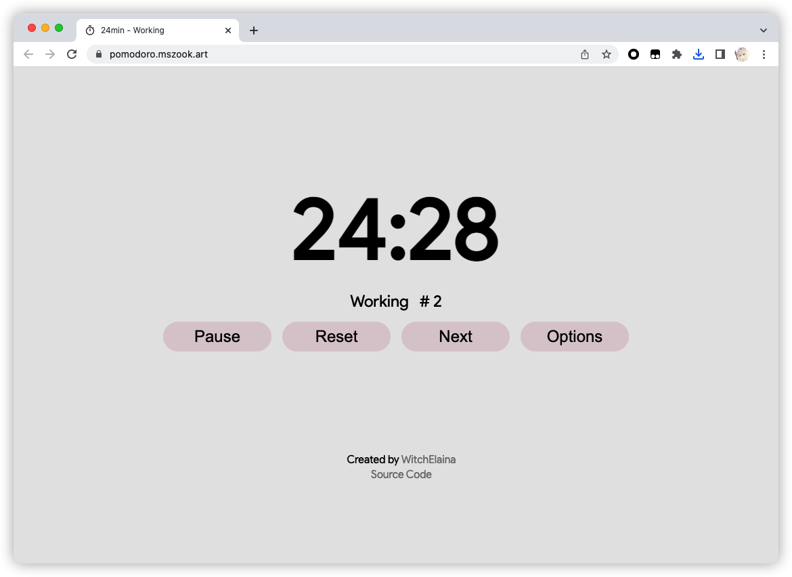

# Pomodoro Timer

A simple pomodoro timer built with [Vue.js](https://vuejs.org/).

## Features

- [x] Set a custom work and break time.
- [ ] Send a notification when the timer is done.
- [ ] Play a sound when the timer is done.
- [ ] Add a todo list.
- [ ] Dark mode.
- [ ] Storage timer state in local storage.
- [ ] Add a pomodoro history.

## Demo

https://pomodoro.mszook.art/



## Project Setup

```sh
npm install
```

### Compile and Hot-Reload for Development

```sh
npm run dev
```

### Compile and Minify for Production

```sh
npm run build
```
